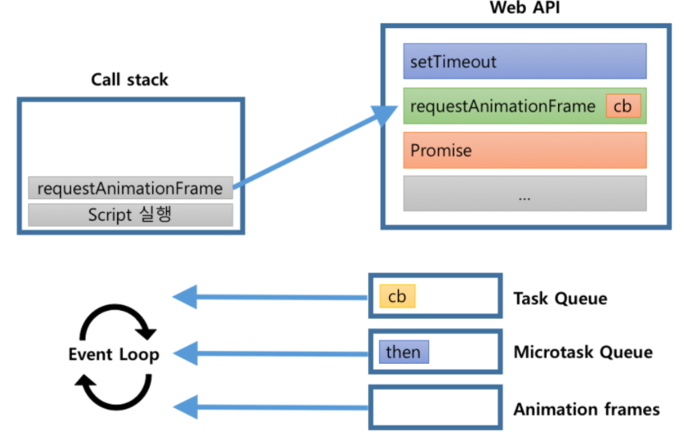
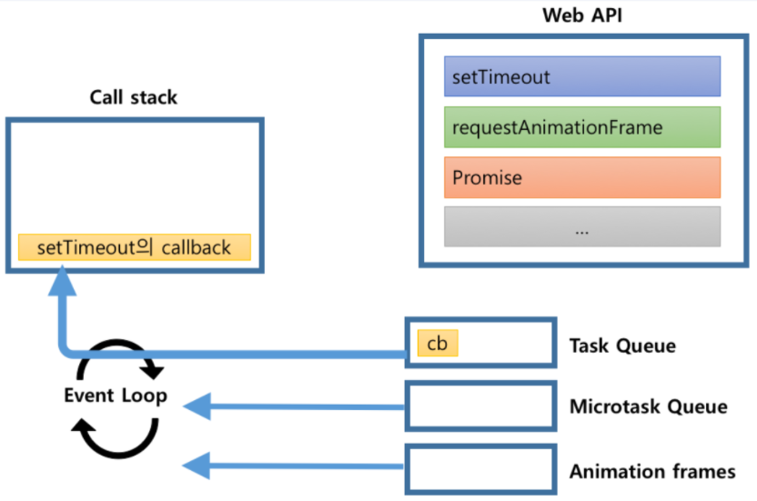

# Javascript

[toc]

## Process Thread

### Process : 컴퓨터(운영체제) 위에서 연속적으로 실행되고 있는 프로그램을 말함

> 각각의 프로세스는 메모리 위에서 서로 독립적으로 실행되고 있다
>
> 그래서 한 프로세스에 문제가 생기면 그 프로세스만 죽게됨
>
> 각 프로세스는 자원들이 정해져 있는데 즉 프로세스마다 할당된 메모리나 데이터들이 지정돼있다.
>
> 프로세스 안에는 
>
> 1. 프로그램을 실행하기위해 작성된 **Code**와 
> 2. 함수들이 어떤 순서로 실행되어야 하는지, 이 함수가 끝나면  어디로 다시 돌아가야 되는지에 대한 정보를 저장하고 있는 **Stack**
> 3. **Heap** : 우리가 오브젝트를 생성하거나 데이터를 만들때 그 데이터들이 저장되는 공간, 동적으로 할당된 변수들이 저장됨
> 4. **Data** : 전역변수나 스태틱 변수들이 할당됨

### Thread : 동시다발적으로 발생할 수 있기 때문에 프로세스가 더 효율적으로 일을 할 수 있게 도움(작은 일꾼 단위)

> 각각 해야되는 업무를 배정받음, 일꾼이라고도 불림
>
> 한 프로세스 안에서 여러개가 동작할 수 있는데 자기들만의 수행해야 되는 함수의 호출을 기억해야 되기 때문에 쓰레드마다 스택이 할당되어져 있음
>
> 하지만 이 프로세스 안에서 동작하는 일꾼들은 결국은 한 프로그램을 위해서 일해야 되므로 코드에 지정된 코드와 데이터 힙들을 공통적으로 접근해서 공통적으로 업데이트가 가능하다

**Thread는 일을 수행할때 어디에서부터 어디까지 일을 했고, 그다음엔 어디로 가야되는지 이런 일의 흐름을 기억할 수 있는 고유의 스택이 지정되어져 있지만 데이터나 코드나 힙같은 공통적인 데이터 리소스는 프로세스에 있기 때문에 threads는 이 프로세스에 공통적으로 할당된 리소스에 동시다발적으로 접속해서 동시다발적으로 업데이트 해야돼서 서로 공유하면서 사용한다. 그래서 멀티쓰레딩이 조금 어려운 이유는 멀티쓰레딩을 잘 못하면 공통적으로 업데이트하면서 이 순서가 맞지 않거나하면 발생할 수 있는 문제가 조금 있다 **


### Multithreading :한 프로세스 안에서 여러가지 thread가 동시다발적으로 일어나는 것을 말함

> JAVA는 언어 자체에서 멀티쓰레딩이 지원됨
>
> JavaScript는 Single Threaded language다 -> 멀티쓰레딩이 없다
>
> 그래서 브라우저에는 여러가지 thread가 있는데 웹 APIs들을 이용하게 되면 멀티쓰레딩이 가능하다 


## Event loop

> [Eventloop출처](https://velog.io/@thms200/Event-Loop-%EC%9D%B4%EB%B2%A4%ED%8A%B8-%EB%A3%A8%ED%94%84)
>
> http://sculove.github.io/blog/2018/01/18/javascriptflow/
>
> **Memory Heap** : 변수를 선언해서 오브젝트를 할당하거나 문자열이나 숫자를 할당하게되면그 데이터들은 전부 메모리 힙에 저장됨, 구조적으로정리된 자료가 아니라 아래 그림과 같이 아무곳에나 저장돼있다
>
> **call stack**은 우리가 함수를 실행하는 순서에 따라 차곡차곡 쌓아놓는 것


### JS Engine

자바스크립트 엔진은 ***Memory Heap*** 과 ***Call Stack*** 으로 구성되어 있다.(그림 왼쪽!)
가장 유명한 것이 구글의 V8 Engine이다.
자바스크립트는 ***단일 스레드 (sigle thread) 프로그래밍*** 언어인데,
이 의미는 ***Call Stack이 하나*** 라는 이야기이다.
*(멀티가 되지 않고, 하나씩 하나씩 처리한다는 의미!)*

- Memory Heap : 메모리 할당이 일어나는 곳
  (ex, 우리가 프로그램에 선언한 변수, 함수 등이 담겨져 있음)
- Call Stack : 코드가 실행될 때 쌓이는 곳. stack 형태로 쌓임.
  - Stack(스택) : 자료구조 중 하나, 선입후출(LIFO, Last In First Out)의 룰을 따른다.

### Web API

그림의 오른쪽에 있는 Wep API는 JS Engine의 밖에 그려져 있다.
즉, 자바스크립트 엔진이 아니다.
***Web API*** 는 ***브라우저에서 제공하는 API*** 로, DOM, Ajax, Timeout 등이 있다.
Call Stack에서 실행된 비동기 함수는 Web API를 호출하고,
Web API는 콜백함수를 Callback Queue에 밀어 넣는다.

### Callback Queue

***비동기적으로 실행된 콜백함수가 보관*** 되는 영역이다.
예를 들어 setTimeout에서 타이머 완료 후 실행되는 함수(1st 인자),
addEventListener에서 click 이벤트가 발생했을 때 실행되는 함수(2nd 인자) 등이 보관된다.

- Queue(큐) : 자료 구조 중 하나, 선입선출(FIFO, Frist In Frist OUT)의 룰을 따른다.

### Event Loop

Event Loop는 Call Stack과 Callback Queue의 상태를 체크하여,
***Call Stack이 빈 상태가 되면, Callback Queue의 첫번째 콜백을 Call Stack으로 밀어넣는다.***
이러한 반복적인 행동을 ***틱(tick)*** 이라 부른다.

> 정리하면,
>
> - V8 엔진에서 코드가 실행되면, Call Stack에 쌓인다.
>
> - Stack의 선입후출의 룰에 따라 제일 마지막에 들어온 함수가 먼저 실행되며,
>
>   Stack에 쌓여진 함수가 모두 실행된다.
>
>   - 비동기함수가 실행된다면, Web API가 호출된다.
>   - Web API는 비동기함수의 콜백함수를 Callback Queue에 밀어넣는다.
>   - Event Loop는 Call Stack이 빈 상태가 되면
>     Callback Queue에 있는 첫번째 콜백을 Call Stack으로 이동시킨다.
>     (이러한 반복적인 행동을 틱(tick)이라 한다.)

**자바스크립트를 단일 스레드 프로그래밍 언어라 한번에 하나씩 밖에 실행할 수 없다.
그러나 Web API, Callback Queue, Event Loop 덕분에 멀티 스레드 처럼 보여진다.**

✨ **중요!**

> **콜스택에서 지금 수행중인 일은 끝날때까지 보장이 된다**
>
> 즉, 중간에 다른 일들을 할 수 없고,  지금 수행중인 코드 블럭이 끝날때까지 이벤트 루프가 기다렸다가 다음에 다른 밑에 있는 콜스택이 수행되거나 task Queue에 있는게 실행이 된다


### Event Loop 와 Queue

자바스크립트는 이 Event Loop와 Queue들을 이용하여 비동기 작업을 수행한다.
직접적인 작업은 Web API에서 처리되고, 그 작업들이 완료되면 요청시 등록했던 callback이 queue에 등록된다.
Event Loop는 이 작업들을 Queue에서 꺼내어 처리한다.
Event Loop는 stack에 처리할 작업이 없을 경우 우선적으로 **microtask queue**를 확인한다.  microtask queue에 작업이 있다면 microtask에 있는 작업을 꺼내서 call stack에 넣는다. 만약 microtask의 queue가 비어서 더 이상 처리할 작업이 없으면 이때 task queue를 확인한다. task queue의 작업도 꺼내서 call stack에 넣는다.
이렇게 Event Loop와 Queue는 자바스크립트 엔진이 하나의 코드 조각을 하나씩 처리할 수 있도록 작업을 스케줄하는 동시에 이러한 이유로 우리는 자바스크립트에서 비동기 작업을 할수 있도록 해준다.

### Javascirpt 처리과정

> [출처](http://sculove.github.io/blog/2018/01/18/javascriptflow/)
>
> - 첫째. 비동기 작업으로 등록되는 작업은 task와 microtask. 그리고 animationFrame 작업으로 구분된다.
> - 둘째. microtask는 task보다 먼저 작업이 처리된다.
> - 셋째. microtask가 처리된 이후 requestAnimationFrame이 호출되고 이후 브라우저 랜더링이 발생한다.

```js
console.log("script start");

setTimeout(function() {
  console.log("setTimeout");
}, 0);

Promise.resolve().then(function() {
  console.log("promise1");
}).then(function() {
  console.log("promise2");
});

requestAnimationFrame(function {
    console.log("requestAnimationFrame");
})
console.log("script end");
```

- 결과

```sh
script start
script end
promise1
promise2
requestAnimationFrame
setTimeout
```

- 과정

1. ‘script 실행 작업’이 stack에 등록된다.
2. console.log(‘script start’)가 처리된다.
3. setTimeout 작업이 stack에 등록되고, Web API에게 setTimeout을 요청한다. 이때 setTimeout의 callback 함수를 함께 전달한다. 요청 이후 stack에 있는 setTimeout 작업은 제거된다.


4. Web API는 setTimeout 작업(0초 후)이 완료되면 setTimeout callback 함수를 task queue에 등록한다.


5. Promise 작업이 stack에 등록되고, Web API에게 Promise 작업을 요청한다. 이때 Promise.then의 callback 함수를 함께 전달한다. 요청 이후 stack에 있는 Promise 작업은 제거된다.


6. Web API는 Promise 작업이 완료되면 Promise.then의 callback 함수를 microtask queue에 등록한다.


7. requestAnimation 작업이 stack에 등록되고, Web API에게 requestAnimation을 요청한다. 이때 requestAnimation의 callback 함수를 함께 전달한다. 요청 이후 stack에 있는 requestAnimation 작업은 제거된다.



8. Web API는 requestAnimation의 callback 함수를 animation frame에 등록한다.


9. console.log(‘script end’)가 처리된다.
10. ‘script 실행 작업’이 완료되어 stack에서 제거된다.
11. stack이 비워있어서 microtask queue에 등록된 Promise.then 의 callback 함수를 stack에 등록한다.


12. 첫번째 Promise.then의 callback 함수가 실행되어 내부의 console.log(‘promise1’)가 처리된다.
13. 첫번째 Promise.then 다음에 Promise.then이 있다면 다음 Promise.then의 callback 함수를 microtask queue에 등록한다.


14. stack 에서 첫번째 Promise.then의 callback 함수를 제거하고 microtask queue에서 첫번째 Promise.then의 callback 함수를 제거한다.
15. 두번째 Promise.then의 callback 함수를 stack에 등록한다.


16. 두번째 Promise.then의 callback 함수가 실행되어 내부의 console.log(‘promise2’)가 처리된다.
17. stack 에서 두번째 Promise.then의 callback 함수를 제거한다.
18. microtask 작업이 완료되면 animation frame에 등록된 callback 함수를 꺼내 실행한다.


19. 이후 브라우저는 랜더링 작업을 하여 UI를 업데이트한다.
20. stack과 microtask queue가 비워있어서 task queue에 등록된 callback 함수를 꺼내 stack에 등록한다.



21. setTimeout의 callback가 실행되어 내부의 console.log(‘setTimeout’)이 처리된다.
22. setTimeout의 callback 함수 실행이 완료되면 stack에서 제거된다.

### Task Queue : 우리가 흔하게 등록한 콜백함수들이 큐에 들어옴

> **이벤트루프가 한번돌때 하나의 콜백함수만 콜스택으로 감**
>
> `setTimeout`은 queue task를 이용

### Microtask Queue : Promise, mutation observer에 등록된 콜백이 들어옴

> **Promise**에 등록된 콜백, 프로미스가 다 수행이 되고 나면 그 다음에 등록한 then에 등록한 콜백함수, 그리고 웹 API 인 **`mutation observer`**에 등록된 콜백이 마이크로 테스크 큐에 들어온다.
>
> **microtask queue에 아이템이 없을때까지 계속 이벤트루프가 머물러있는다**


### Render : 브라우저에서 우리가 변형한 코드가 업데이트되기 위해 주기적으로 호출하는 순서


> 주기적으로 브라우저에서 우리가 요소들을 움직이거나 애니메이션 할 때 주기적으로 브라우저에 업데이트 해줘야됨 그때 변형된 코드를 주기적으로 화면에 업데이트 해줌
>
> 브라우저에 표기되기 위해선 랜더트리가 만들어져야되고, 레이아웃 크기와 위치들이 계산된 다음 paint와 composite과정을 통해 표기됨
>
> 웹 API중 **Request Animation Frame**이 있는데 이 API를 통해 콜백을 등록해 놓으면 다음에 브라우저가 업데이트 되기 전에 내 콜백을 실행
>
> 그때 호출하는 콜백은 Request Animation Frame의 queue에 쌓임

#### Request Animation Frame :  Render전에 이 API를 부르면 그때 우리가 등록한 콜백은 이 Request Animation Frame queue에 쌓임


### Q. 브라우저는 어떻게 위 과정을 동시에 순서적으로 잘 실행하는가?


> 이벤트 루프는 `while (true){}`같이 계속 빙글빙글 도는 루프 중 하나
>
> 평소에는 빙글빙글 돌다가 콜스택에 수행중인 함수가 있다면 그게 끝날때까지 머무른다 즉 콜스택에 들어있는 함수가 끝날때까지 꼼짝도 안하고 기다림 그래서 만약 콜스택에 있는 함수 중 시간이 오래걸리는 것을 하게되면 사용자에게 더이상 화면이 업데이트 되어져서  보이지가 않는다, 그리고 다른 클리이 발생해도 그 클릭에 등록된 콜백 함수가 실행이 되지 않는다.
>
> 그 함수가 끝나야지 다시 빙글빙글 돌기 시작함 **Render**쪽은 갈수도 있고 안갈수도 있음 => WHY?? 브라우저에서는 우리가 업데이트 하는 내용들을 사용자에게  **60frames** 1초동안 60개의 프레임을 보여주도록 노력함(16.7ms동안 업데이트가 일어나야됨)
>
> 이벤트루프는 한바퀴도는데 1ms도 걸리지 않는다. 엄청 빠름! 그래서 1ms마다 이 Render업데이트를 할필요가 없기 때문에 갈수도, 안갈수도 있는것이다!
>
> 그래서 브라우저마다 지정된 시간이 다르지만 대부분은 어느정도 시간이 지나고 랜더를 돌고 다시 업데이트해주고 다시 돌고 이런식!
>
> 그리고 Microtask Queue로 갔을때 콜백함수가 있다면 하나씩 콜스택으로 가지고 감
>
> 
>
> 
>
> 나중에 들어온 콜백도 전부다 끝날때까지, 마이크로테스크 큐가 빌때까지 계속 콜 스택으로 가지고 와서 수행을 함, 예를들어 mutation observer의 콜백이 끝나기 전에 다른 promise then콜백이 들어와서 마이크로테스크 큐에 쌓인다면 mutation observer이 끝나는 순간 promise then이 콜스택으로 와서 수행하게됨(이벤트루프는 다 끝날때까지 microtask Queue에 머무름)
>
> 그렇게해서 microtask Queue가 텅비면 **Task Queue**로 넘어옴 여기서는 한번에 딱 하나의 아이템만 콜스택으로 가져옴, 마이크로 테스크큐에서는 아이템들이 없어질때까지 심지어 새로들어오는 것도 전부 다 끝날때까지 기다린 반면에 task queue에서는 아이템 하나만 콜스택으로 보내놓고 콜백이 끝나면 다시 동그라미 순회를 시작하게됨 **(task Queue에 쌓인 콜백중 1개만!)** 
>
> 그러다 브라우저를 업데이트할 시간이되면 **Render**로 들어가서 먼저 **Request Animation Frame**을 통해 등록된 콜백함수들을 하나하나 실행한 다음 랜더 tree로 가서 랜더 트리를 만들고 그 트리를 이용해서 레이아웃을 계산한 다음에 페인트를 통해 브라우저에 업데이트를 하고 다시 이벤트루프는 가던길을 가게된다 그러다가 tesk queue에 아이템이 하나 더 남았으니 다시 콜스택으로 가지고가서 실행시킴


### Q. addEventListener안에 등록된 코드블럭 순서는 중요할까?

```js
const button = document.querySelector('button');
button.addEventlistener('click',()=>{
    const element = document.createElement('h1');
    document.body.appendChild(element);
    element.style.color = 'red';
    element.innerText = 'hello';
});
```

> 웹 API의 클릭 이벤트가 발생하면 이 콜백을  task queue에 넣어줌
>
> 콜백안에 작성된 코드는 어떤순서든 상관없다!
>
> WHY??
>
> 이 콜백이 콜백스택에 들어가는 순간 이벤트 루프는 이것이 다 실행될때까지 기다렸다가 나중에 렌더링이 될때 전체적으로 적용된 아이들이 레이아웃, 페인트에 걸쳐서 브라우저에 표기되기 때문이다

