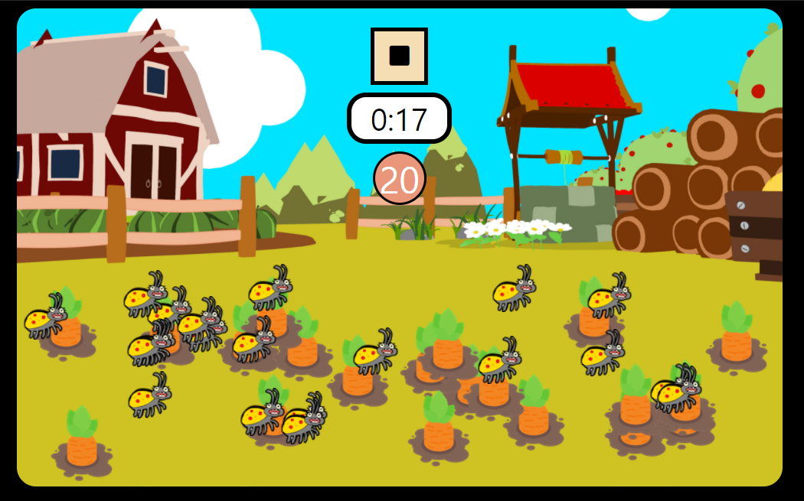
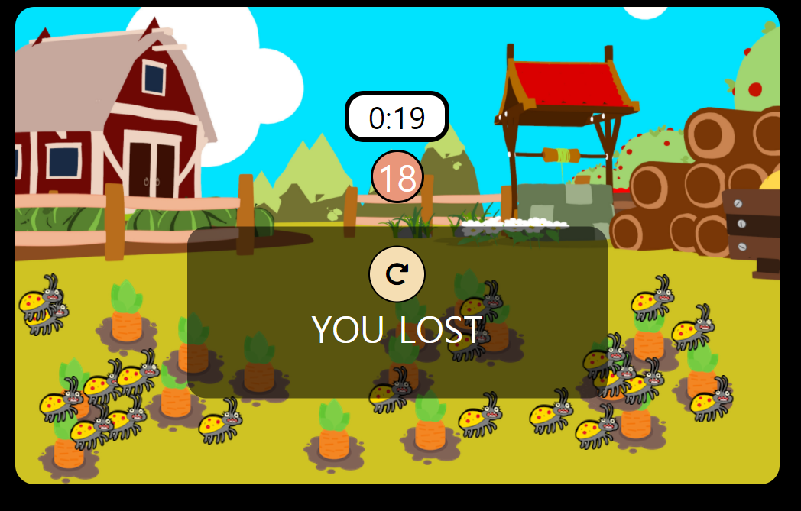
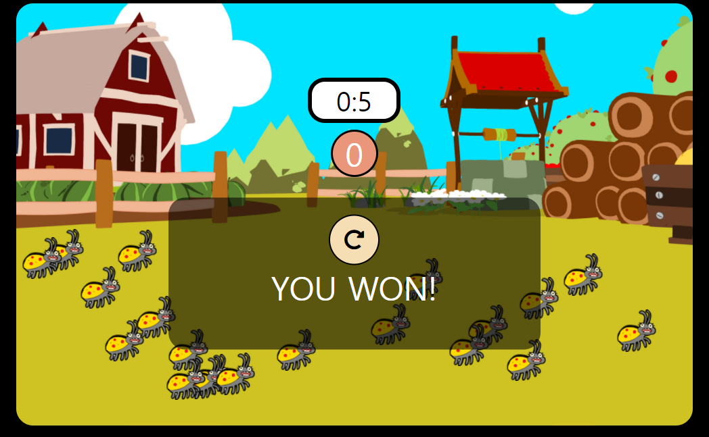

# Fun Game 실습

[toc]







- `index.html` 마크업

> `defer`이 없으면 html이 준비되기 이전에 실행이 되기 때문에 안됨
>
> `type = "module"` 해줘야 js를 모듈로 분리시킬 수 있다

```html
<!DOCTYPE html>
<html lang="en">
<head>
  <meta charset="UTF-8">
  <meta http-equiv="X-UA-Compatible" content="IE=edge">
  <meta name="viewport" content="width=device-width, initial-scale=1.0">
  <title>Fun Game</title>
  <link rel="stylesheet" href="style.css">
  <script type="module" src="src/main.js" defer></script>
  <link rel="stylesheet" href="https://use.fontawesome.com/releases/v5.15.2/css/all.css"
    integrity="sha384-vSIIfh2YWi9wW0r9iZe7RJPrKwp6bG+s9QZMoITbCckVJqGCCRhc+ccxNcdpHuYu" crossorigin="anonymous">
</head>
<body>
  <section class="game">
    <header class="game__header">
      <button class="game__button">
        <i class="fas fa-play"></i>
      </button>
      <span class="game__timer">0:0</span>
      <span class="game__score">9</span>
    </header>
    <section class="game__field"></section>
  </section>
  <section class="pop-up pop-up--hide">
    <button class="pop-up__refresh">
      <i class="fas fa-redo-alt"></i>
    </button>
    <span class="pop-up__message">Hello</span>
  </section>
</body>
</html>
```

- `style.css`

```css
button {
  border: none;
  outline: none;
  cursor: pointer;
}

body {
  text-align: center;
  background-color: black;
}

.game {
  display: flex;
  flex-direction: column;
  width: 800px;
  height: 500px;
  margin: auto;
  /* 배경 center로 / 사이즈는 cover */
  background: url(img/background.png) center/cover;
  border-radius: 20px;
}

.game__header {
  display: flex;
  flex-direction: column;
  align-items: center;
  padding: 20px;
}

.game__button {
  width: 60px;
  height: 60px;
  background-color: wheat;
  border: 4px solid black;
  font-size: 24px;
  transition: transform 300ms ease-in;
}

.game__button:hover {
  transform: scale(1.1);  
}

.game__timer {
  width: 100px;
  background-color: white;
  text-align: center;
  border: 5px solid black;
  border-radius: 20px;
  font-size: 32px;
  margin-top: 8px;
  visibility: hidden;
  /* 선택되지않게하기위해(드래그되는거?) */
  user-select: none;
  cursor: auto;
}

.game__score {
  text-align: center;
  width: 50px;
  height: 50px;
  margin-top: 8px;
  font-size: 38px;
  border-radius: 50%;
  border: 3px solid black;
  background-color: darksalmon;
  color: white;
  visibility: hidden;
    /* 선택되지않게하기위해(드래그되는거?) */
  user-select: none;
  cursor: auto;
}


.game__field {
  position: relative;
  width: 100%;
  height: 100%;
  margin-top: 40px;
}

.pop-up {
  display: block;
  width: 400px;
  height: 140px;
  margin: auto;
  padding: 20px;
  /* opacity: 0.7; */
  /* 000000 색상 90은 투명도 -> 이러면 배경색만 투명도가 생김*/
  background-color: #00000090;
  border-radius: 20px;
  color: white;
  text-align: center;
  transform: translateY(-150%);
}

.pop-up--hide {
  display: none;
}

.pop-up__refresh {
  width: 60px;
  height: 60px;
  font-size: 24px;
  background-color: wheat;
  border: 2px solid black;
  border-radius: 50%;
}

.pop-up__message {
  display: block;
  font-size: 38px;
}

.carrot,
.bug {
  transition: transform 100ms ease-in;
}

.carrot:hover,
.bug:hover {
  transform: scale(1.1);
}
```

- `main.js`

```js
'use strict';

const CARROT_SIZE = 80;
const CARROT_COUNT = 20;
const BUG_COUNT = 20;
const GAME_DURATION_SEC = 20;

const field = document.querySelector('.game__field');
const fieldRect = field.getBoundingClientRect();
const gameBtn = document.querySelector('.game__button');
const gameTimer = document.querySelector('.game__timer');
const gameScore = document.querySelector('.game__score');

const popUp = document.querySelector('.pop-up');
const popUpText = document.querySelector('.pop-up__message');
const popUpRefresh = document.querySelector('.pop-up__refresh');

const carrotSound = new Audio('./sound/carrot_pull.mp3');
const alertSound = new Audio('./sound/alert.wav');
const bgSound = new Audio('./sound/bg.mp3');
const bugSound = new Audio('./sound/bug_pull.mp3');
const winSound = new Audio('./sound/game_win.mp3');


let started = false;
let score = 0;
let timer = undefined;

field.addEventListener('click', onFiledClick);
gameBtn.addEventListener('click',()=>{
  if (started) {
    stopGame();
  } else {
    startGame();
  }
});
popUpRefresh.addEventListener('click', ()=>{
  startGame();
  hidePopUp();
})

function startGame() {
  started = true;
  initGame();
  showStopButton();
  showTimerAndScore();
  startGameTimer();
  playSound(bgSound);
}
function stopGame() {
  started = false;
  stopGameTimer();
  hideGameButton();
  showPopUpWithText('REPLAY?');
  playSound(alertSound);
  stopSound(bgSound);
};

function finishGame(win) {
  started = false;
  hideGameButton();
  if (win) {
    playSound(winSound); 
  } else {
    playSound(bugSound);
  }
  stopGameTimer();
  stopSound(bgSound);
  showPopUpWithText(win ? 'YOU WON!' : 'YOU LOST');
};

function showStopButton() {
  const icon = gameBtn.querySelector('.fas');
  icon.classList.add('fa-stop');
  icon.classList.remove('fa-play');
  gameBtn.style.visibility = 'visible';
};

function hideGameButton() {
  gameBtn.style.visibility = 'hidden';
};

function showTimerAndScore() {
  gameTimer.style.visibility = 'visible';
  gameScore.style.visibility = 'visible';
};

function startGameTimer() {
  // setInterval api이용
  // timer를 함수 밖에서도 사용해야되니까 global변수로 사용
  let remainingTimeSec = GAME_DURATION_SEC;
  updateTimerText(remainingTimeSec);
  timer = setInterval(()=>{
    if (remainingTimeSec <= 0) {
      clearInterval(timer);
      finishGame(CARROT_COUNT === score);
      return
    }
    //remainingTimeSec 1초씩 줄어들어야됨
    updateTimerText(--remainingTimeSec)
  },1000);
};

function stopGameTimer() {
  clearInterval(timer);
};

function updateTimerText(time) {
  const minutes = Math.floor(time/60);
  const seconds = time % 60;
  gameTimer.innerText = `${minutes}:${seconds}`
};

function showPopUpWithText(text) {
  popUpText.innerText = text;
  popUp.classList.remove('pop-up--hide');
};

function hidePopUp() {
  popUp.classList.add('pop-up--hide')
};

function initGame() {
  score = 0;
  field.innerHTML = '';
  gameScore.innerText = CARROT_COUNT;
  // 벌레와 당근을 생성한뒤 field에 추가해줌
  addItem('carrot',CARROT_COUNT,'img/carrot.png');
  addItem('bug',BUG_COUNT,'img/bug.png');
}

function onFiledClick(event) {
  if (!started) {
    return;
  }
  const target = event.target;
  // matches란 함수는 css셀렉터가 해당하는지 확인함
  // carrot클래스를 가진 타겟이면
  if (target.matches('.carrot')) {
    // 당근!
    target.remove();
    score++;
    playSound(carrotSound);
    updateScoreBoard();
    if (score === CARROT_COUNT) {
      finishGame(true);
    }
  } else if(target.matches('.bug')) {
    // 벌레!
    finishGame(false);
  } 
}

function playSound(sound) {
  // 시작을 처음부터하게 설정
  sound.currentTime = 0;
  sound.play();
};

function stopSound(sound) {
  sound.pause();
};

function updateScoreBoard() {
  gameScore.innerText = CARROT_COUNT - score;
}

function addItem(className,count,imgPath) {
  const x1 = 0;
  const y1 = 0;
  // 필드의 끝값에서 당근 사이즈만큼 빼줘야 필드안에 들어감
  const x2 = fieldRect.width-CARROT_SIZE;
  const y2 = fieldRect.height-CARROT_SIZE;
  for (let i = 0; i < count; i++) {
    const item = document.createElement('img');
    item.setAttribute('class',className);
    item.setAttribute('src',imgPath);
    item.style.position = 'absolute';
    const x = randomNumber(x1,x2);
    const y = randomNumber (y1,y2);
    item.style.left = `${x}px`;
    item.style.top = `${y}px`;
    field.appendChild(item); 
  }
}
// 랜덤숫자를 만들어주는 함수
function randomNumber(min,max) {
  return Math.random() * (max-min) + min;
}

initGame();
```


### 리팩토링

- 각 역할별로 js를 분리시킴

- `main.js`

```js
'use strict';
import PopUp from './popup.js';
import * as sound from './sound.js'
import { GameBuilder, Reason } from './game.js';


const gameFinishBanner = new PopUp();

// 생성자의 인자가 뭔지 알수없는 코드는 좋지않다
// const game = new Game(3,2,2);
// 이러면 우리가 어떤 값을 설정하는지 한눈에 볼 수 있다
const game = new GameBuilder()
.withGameDuration(60)
.withCarrotCount(15)
.withBugCount(10)
.build();

game.setGameStopListener((reason) => {
  let message;
  switch(reason) {
    case Reason.cancel:
      message = 'Replay?';
      sound.playAlert();
      break;
    case Reason.win:
      message = 'YOU WON!';
      sound.playWin();
      break;
    case Reason.lose:
      message = 'YOU LOST!';
      sound.playBug();
      break;
      default:
        throw new Error('not valid reason!');
  }
  gameFinishBanner.showWithText(message);
});
gameFinishBanner.setClickListener(()=>{
  game.start();
});
```


- `popup.js`

```js
'use strict';

// export시키면 이 class를 밖으로 노출시키는거다 이파일에서 뿐만아니라 외부에서도 이 클래스를 볼 수 있다
export default class PopUp {
  constructor() {
    this.popUp = document.querySelector('.pop-up');
    this.popUpText = document.querySelector('.pop-up__message');
    this.popUpRefresh = document.querySelector('.pop-up__refresh');
    this.popUpRefresh.addEventListener('click',()=>{
      // 콜백이 있으면 this.onClick이 true
      this.onClick && this.onClick();
      this.hide();
    })
  }
  // class에 popUp콜백으로 등록해놓을테니 네 팝업에서 버튼이 클릭되면 전달해준 onClick을 호출해라
  setClickListener(onClick) {
    // onClick이라는 멤버변수를 만듦
    this.onClick = onClick;
  }
  
  showWithText(text) {
  this.popUpText.innerText = text;
  this.popUp.classList.remove('pop-up--hide');
}

  hide() {
    this.popUp.classList.add('pop-up--hide');
  }
}
```

- `field.js`

```js
'use strict';
import * as sound from './sound.js'

const CARROT_SIZE = 80;
export const ItemType = Object.freeze({
  carrot:'carrot',
  bug:'bug',
});

export class Field {
  constructor(carrotCount, bugCount) {
    this.carrotCount = carrotCount;
    this.bugCount = bugCount;
    this.field = document.querySelector('.game__field');
    this.fieldRect = this.field.getBoundingClientRect();
    // JS에서는 onClick이 포함된 클래스 정보가 같이 콜백으로 전달되지 않는다.(추가설명 아래 onClick메소드에적음)
    // this바인딩방법1.
    // this.onClick = this.onClick.bind(this);
    // 바인딩방법2. arrow function을 씀(arrow function은 this가 유지됨)
    // this.field.addEventListener('click',(event) => this.onClick(event));
    // 바인딩방법3. onClick을 멤버변수로 만들고 이 멤버변수는 arrow function으로 가리키고 있음
    this.field.addEventListener('click',this.onClick);

  }
  init() {
    this.field.innerHTML = '';
    // 벌레와 당근을 생성한뒤 field에 추가해줌
    this._addItem('carrot',this.carrotCount,'img/carrot.png');
    this._addItem('bug',this.bugCount,'img/bug.png');
  }
  
  setClickListener(onItemClick) {
    this.onItemClick = onItemClick;
  }

  // js에서는 아직 private한 함수를 만들 수 없기 때문에 _를 앞에 붙여서 프라이빗한 것이라고 알수있게 표시함
  _addItem(className,count,imgPath) {
  const x1 = 0;
  const y1 = 0;
  // 필드의 끝값에서 당근 사이즈만큼 빼줘야 필드안에 들어감
  const x2 = this.fieldRect.width-CARROT_SIZE;
  const y2 = this.fieldRect.height-CARROT_SIZE;
  for (let i = 0; i < count; i++) {
    const item = document.createElement('img');
    item.setAttribute('class',className);
    item.setAttribute('src',imgPath);
    item.style.position = 'absolute';
    // randomNumber는 밖에 class밖에 있기 때문에 this.를 붙이지 않아도 됨
    const x = randomNumber(x1,x2);
    const y = randomNumber (y1,y2);
    item.style.left = `${x}px`;
    item.style.top = `${y}px`;
    this.field.appendChild(item); 
  }
}

  // 실제로 이 onclick이 다른 곳에서콜백으로 전달됐을때는 this.라는 정보가 이제 존재하지 않기 때문에 아이템 클릭이 계속 undefinded상태가됨
  // 그래서 JS에서는 누군가에게 전달해줄때 class정보가 무시되기 떄문에 클래스 정보를 무시하고 싶지 않을때는 바인딩을 해줘야된다!('this바인딩'이라고 함)
  // this 바인딩 방법 3가지가 있음
// 바인딩방법3. onClick을 멤버변수로 만들고 이 멤버변수는 arrow function으로 가리키고 있음
  onClick = event => {
    const target = event.target;
  // matches란 함수는 css셀렉터가 해당하는지 확인함
  // carrot클래스를 가진 타겟이면
  if (target.matches('.carrot')) {
    // 당근!
    target.remove();
    sound.playCarrot();
    this.onItemClick && this.onItemClick(ItemType.carrot);
  } else if(target.matches('.bug')) {
    // 벌레!
    this.onItemClick && this.onItemClick(ItemType.bug);
  } 
  }
}

// 클래스에 포함되지 않는 함수는 class밖에 두는것이 계속 불러오지 않고 효율적이다

// 랜덤숫자를 만들어주는 함수
function randomNumber(min,max) {
  return Math.random() * (max-min) + min;
}
```

- `game.js`

```js
import { Field, ItemType} from './field.js';
import * as sound from './sound.js'

export const Reason = Object.freeze({
  win:'win',
  lose:'lose',
  cancel:'cancel',
});

// Builder Pattern
export class GameBuilder {
  withGameDuration(duration) {
    this.gameDuration = duration;
    // class 자체를 return한단 말
    return this;
  }
  withCarrotCount(num) {
    this.carrotCount = num;
    return this;
  }
  withBugCount(num) {
    this.bugCount = num;
    return this;
  }
  build() {
    console.log(this);
    // Game이란 클래스를 만들어서 리턴
    return new Game(
      this.gameDuration,
      this.carrotCount,
      this.bugCount
    );
  }
}

// Game class는 외부에 노출시키지 않을거다
class Game {
  constructor(gameDuration, carrotCount, bugCount) {
    this.gameDuration = gameDuration;
    this.carrotCount = carrotCount;
    this.bugCount = bugCount;
    this.gameTimer = document.querySelector('.game__timer');
    this.gameScore = document.querySelector('.game__score');
    
    this.gameBtn = document.querySelector('.game__button');
    this.gameBtn.addEventListener('click',()=>{
      if (this.started) {
        this.stop(Reason.cancel);
      } else {
        this.start();
      }
    });

    this.gameField = new Field(carrotCount,bugCount);
    this.gameField.setClickListener(this.onItemClick);
    
    this.started = false;
    this.score = 0;
    this.timer = undefined;

  }
  
  setGameStopListener(onGameStop) {
    this.onGameStop = onGameStop;
  }

  start() {
  this.started = true;
  this.initGame();
  this.showStopButton();
  this.showTimerAndScore();
  this.startGameTimer();
  sound.playBackground();
}
stop(reason) {
  this.started = false;
  this.stopGameTimer();
  this.hideGameButton();
  sound.stopBackground();
  this.onGameStop && this.onGameStop(reason);
}

  
onItemClick = (item) => {
  if (!this.started) {
    return;
  }
  if (item === ItemType.carrot) {
    this.score++;
    this.updateScoreBoard();
    if (this.score === this.carrotCount) {
      this.stop(Reason.win);
    }
  } else if(item === ItemType.bug) {
    // 벌레!
    this.stop(Reason.lose);
  } 
}


showStopButton() {
  const icon = this.gameBtn.querySelector('.fas');
  icon.classList.add('fa-stop');
  icon.classList.remove('fa-play');
  this.gameBtn.style.visibility = 'visible';
};

hideGameButton() {
  this.gameBtn.style.visibility = 'hidden';
};

showTimerAndScore() {
  this.gameTimer.style.visibility = 'visible';
  this.gameScore.style.visibility = 'visible';
};

startGameTimer() {
  // setInterval api이용
  // timer를 함수 밖에서도 사용해야되니까 global변수로 사용
  let remainingTimeSec = this.gameDuration;
  this.updateTimerText(remainingTimeSec);
  this.timer = setInterval(()=>{
    if (remainingTimeSec <= 0) {
      clearInterval(this.timer);
      this.stop(this.carrotCount === this.score ? Reason.win : Reason.lose);
      return
    }
    //remainingTimeSec 1초씩 줄어들어야됨
    this.updateTimerText(--remainingTimeSec)
  },1000);
};

stopGameTimer() {
  clearInterval(this.timer);
}

updateTimerText(time) {
  const minutes = Math.floor(time/60);
  const seconds = time % 60;
  this.gameTimer.innerText = `${minutes}:${seconds}`
}

updateScoreBoard() {
  this.gameScore.innerText = this.carrotCount - this.score;
}

initGame() {
  this.score = 0;
  this.gameScore.innerText = this.carrotCount;
  this.gameField.init();
}

};
```

- `sound.js`

```js
const carrotSound = new Audio('./sound/carrot_pull.mp3');
const alertSound = new Audio('./sound/alert.wav');
const bgSound = new Audio('./sound/bg.mp3');
const bugSound = new Audio('./sound/bug_pull.mp3');
const winSound = new Audio('./sound/game_win.mp3');


export function playCarrot() {
  playSound(carrotSound)
}

export function playBug() {
  playSound(bugSound)
}

export function playAlert() {
  playSound(alertSound)
}

export function playWin() {
  playSound(winSound)
}

export function playBackground() {
  playSound(bgSound)
}

export function stopBackground() {
  stopSound(bgSound)
}


function playSound(sound) {
  // 시작을 처음부터하게 설정
  sound.currentTime = 0;
  sound.play();
};

function stopSound(sound) {
  sound.pause();
};

```


#### (참고) this 바인딩 방법 3가지

> 1. `this.onClick = this.onClick.bind(this);`
> 2.  arrow function을 씀(arrow function은 this가 유지됨)
>    `this.field.addEventListener('click',(event) => this.onClick(event));`
>
> 3. onClick을 멤버변수로 만들고 이 멤버변수는 arrow function으로 가리키고 있음
>
>    ` onClick = event => {}`

```js
export default class Field {
  constructor(carrotCount, bugCount) {
    this.carrotCount = carrotCount;
    this.bugCount = bugCount;
    this.field = document.querySelector('.game__field');
    this.fieldRect = this.field.getBoundingClientRect();
    // JS에서는 onClick이 포함된 클래스 정보가 같이 콜백으로 전달되지 않는다.(추가설명 아래 onClick메소드에적음)
    // this바인딩방법1.
    // this.onClick = this.onClick.bind(this);
    // 바인딩방법2. arrow function을 씀(arrow function은 this가 유지됨)
    // this.field.addEventListener('click',(event) => this.onClick(event));
    // 바인딩방법3. onClick을 멤버변수로 만들고 이 멤버변수는 arrow function으로 가리키고 있음
    this.field.addEventListener('click',this.onClick);

  }
  // 실제로 이 onclick이 다른 곳에서콜백으로 전달됐을때는 this.라는 정보가 이제 존재하지 않기 때문에 아이템 클릭이 계속 undefinded상태가됨
  // 그래서 JS에서는 누군가에게 전달해줄때 class정보가 무시되기 떄문에 클래스 정보를 무시하고 싶지 않을때는 바인딩을 해줘야된다!('this바인딩'이라고 함)
  // this 바인딩 방법 3가지가 있음
// 바인딩방법3. onClick을 멤버변수로 만들고 이 멤버변수는 arrow function으로 가리키고 있음
  onClick = event => {
    const target = event.target;
  // matches란 함수는 css셀렉터가 해당하는지 확인함
  // carrot클래스를 가진 타겟이면
  if (target.matches('.carrot')) {
    // 당근!
    target.remove();
    sound.playCarrot();
    this.onItemClick && this.onItemClick('carrot');
  } else if(target.matches('.bug')) {
    // 벌레!
    this.onItemClick && this.onItemClick('bug');
  } 
  }
}

// 클래스에 포함되지 않는 함수는 class밖에 두는것이 계속 불러오지 않고 효율적이다

// 랜덤숫자를 만들어주는 함수
function randomNumber(min,max) {
  return Math.random() * (max-min) + min;
}
```

